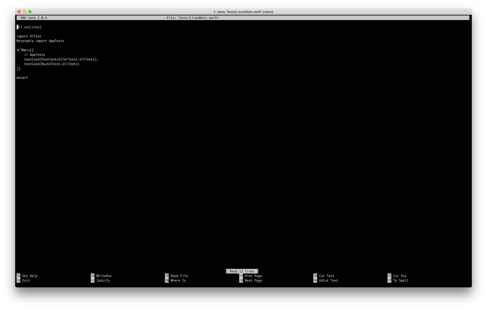

# Creating Tests

## Creating the Test

Creating the test is straightforward. Open up your project, and right click on `AppTests` and click on new file. Make sure it's a swift file, and that the target is set to `AppTests`.


## Setting up the Test

Next step is to finally set-up the imports. Make sure you have something looking like this:

```swift

import XCTest
import Testing
@testable import Vapor
@testable import App

```

These 4 are the most required, with the added `@testable` to indicate that these targets are only to be used to be tested.

---

When you're creating your class, make sure to also conform it to `TestCase`, as that's the `XCTestCase` with a bit of an added flavour thanks to Vapor.

Each function in this class will represent a portion of the tests. For example, my whole test could be the controller, but I'm testing portions of the controller such as the `POST` request, or a `GET` request in which i'm retrieving a specific amount of users.


## Adding support for Linux

We need to add support for linux so that we can deploy it to our servers.
Once you're done creating your specified tests, create an extension that adds all the tests. 

```swift

extension ExampleTests {
    /// This is a requirement for XCTest on Linux
    /// to function properly.
    /// See ./Tests/LinuxMain.swift for examples
    static let allTests = [
        ("testPostRoute", testPostRoute),
    ]
}
```

For each function that has a test, with the little symbol, the more tests you'll have to add in `allTests`. For example, if I had a test function called `testPostRoute` and another one called `testPutRoute`, I would have to also put `testPutRoute` as well, since that's another one I'd have to test.

Finally, you can't open up `./Tests/LinuxMain.swift` on XCode, so you'll have to open it up on terminal via `nano`, or `vim`. I prefer nano in this case, since it's a small case.

Do `nano Tests/LinuxMain.swift`. You should see the `testCases` and the extension variable that you created. Add the one you made from your test file class. Hit `ctrl+x` and tap `y` to save the file.

